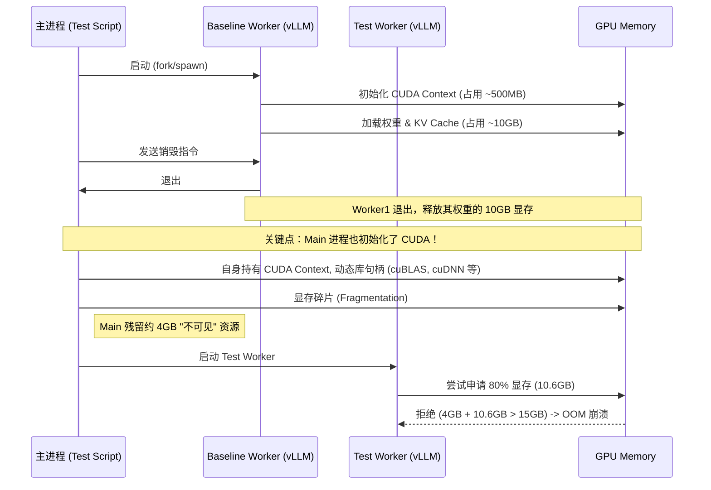

# SlideSparse + torch.compile 兼容性探查报告

**作者**: expert C
**日期**: 2026-01-24  
**版本**: 1.0

---

## 目录

1. [问题背景](#1-问题背景)
2. [调试过程](#2-调试过程)
3. [尝试的解决方案](#3-尝试的解决方案)
4. [关键发现](#4-关键发现)
5. [问题根源分析](#5-问题根源分析)
6. [改进建议](#6-改进建议)
7. [遗留问题与风险](#7-遗留问题与风险)
8. [附录：测试脚本](#8-附录测试脚本)

---

## 1. 问题背景

### 1.1 项目架构

SlideSparse 是一个在 vLLM 框架下加速 LLM 推理的项目，支持 FP8/INT8 量化。核心架构采用"离线调优 + 在线查表"策略：

```
SlideSparse Kernel 路径:
├── cuBLASLt:    Triton quant_only + cuBLASLt GEMM + Triton dequant_bias
├── cuSPARSELt:  Triton quant_slide + cuSPARSELt 2:4 GEMM + Triton dequant_bias
└── CUTLASS:     vLLM 原生路径（fallback）
```

### 1.2 核心文件

| 文件 | 功能 |
|------|------|
| `kernels.py` | Triton kernel 加载、Custom Op 注册 |
| `gemm_wrapper.py` | cuBLASLt/cuSPARSELt GEMM 包装器 |
| `SlideSparseLinearMethod_FP8.py` | FP8 Linear 方法实现 |
| `SlideSparseLinearMethod_INT8.py` | INT8 Linear 方法实现 |
| `__init__.py` | 模块初始化、`init_slidesparse()` |

### 1.3 问题现象

运行 `test_04_throughput.py` 时，在 SlideSparse cuBLASLt 路径下出现：
```
torch.AcceleratorError: CUDA error: unspecified launch failure
```

用户怀疑是 `torch.compile` + `model_name` 动态参数导致的兼容性问题。

---

## 2. 调试过程

### 2.1 初始假设

根据用户提供的背景信息，初始怀疑的问题层级：

| 层级 | 问题描述 | 初始判断 |
|------|----------|----------|
| Dynamo 追踪 | `setattr` 副作用 | 已解决（模块级初始化） |
| Dynamo 追踪 | 文件系统操作 | 已解决（预加载机制） |
| Dynamo 追踪 | 动态模块 import | 疑似问题点 |
| torch.compile | FakeTensor `data_ptr()` | 已通过 custom op 解决 |
| CUDAGraph | 非法内存访问 | **当前卡点** |

### 2.2 测试方法论

我创建了多个测试脚本来隔离问题：

1. **`debug_compile_solutions.py`**: 验证不同的 torch.compile 兼容方案
2. **`debug_compile_flow.py`**: 模拟完整的 Linear 层流程
3. **直接 vLLM 测试**: 简化的 LLM.generate() 调用

### 2.3 关键测试结果

#### 测试 A: 当前 Custom Op 方案

```python
def fn_with_model_name(input_tensor):
    return quant_only_fp8_kernel(input_tensor, "Llama3.2-1B-FP8")

compiled_fn = torch.compile(fn_with_model_name, fullgraph=True)
```

**结果**: ✅ **通过**（包括 CUDAGraph 捕获和 replay）

#### 测试 B/C: 直接使用预加载的函数（绕过 Custom Op）

```python
kernel_fn = _load_quant_only_fp8_kernel("Llama3.2-1B-FP8")
bound_fn = lambda x: kernel_fn(x)
compiled_fn = torch.compile(bound_fn, fullgraph=True)
```

**结果**: ❌ **失败**
```
ModuleNotFoundError: No module named 'quant_only_tuned_Llama3'
```

**原因**: Dynamo 检查 `fn.__module__`，尝试 import 包含 `.` 和 `-` 的非法模块名

#### 测试 D: Triton 原生支持（静态定义的 kernel）

```python
from basic_quant_only_triton import quant_only_fp8_triton
compiled_fn = torch.compile(quant_only_fp8_triton, fullgraph=True)
```

**结果**: ✅ **通过**

#### 测试 E: 简化 Custom Op（移除 model_name 参数）

```python
_test_lib.define("quant_fp8_simple(Tensor input) -> (Tensor, Tensor)")
# 实现使用预绑定的 kernel
```

**结果**: ✅ **通过**

#### 测试: 完整 Linear 流程（quant → GEMM → dequant）

```python
def forward_fn(input_tensor):
    qinput, scale_a = quant_only_fp8_kernel(input_tensor, "Llama3.2-1B-FP8")
    gemm_out_pad = cublaslt_fp8_mm_op(weight, qinput, "bf16")
    gemm_out = gemm_out_pad[:M_actual, :]
    output = dequant_bias_kernel(gemm_out, scale_a, weight_scale, bias, torch.bfloat16, "Llama3.2-1B-FP8")
    return output
```

**结果**: ✅ **通过**（torch.compile + 动态形状 + CUDAGraph）

#### 测试: 简单 vLLM 推理

```python
llm = LLM(model='Llama3.2-1B-FP8', enforce_eager=False)
outputs = llm.generate(['Hello'], SamplingParams(max_tokens=20))
```

**结果**: ✅ **通过**（eager 和 compile 模式都成功）

#### 测试: test_04_throughput.py 的真实流程

```python
# Step 1: Baseline (DISABLE_SLIDESPARSE=1)
set_env_for_baseline()
llm = LLM(...)  # baseline
del llm

# Step 2: Test (USE_CUBLASLT=1)
set_env_for_test(use_cublaslt=True)
llm = LLM(...)  # ❌ 失败
```

**结果**: ❌ **失败**（CUDA OOM）

---

## 3. 尝试的解决方案

### 3.1 方案矩阵

| 方案 | 描述 | 结果 | 说明 |
|------|------|------|------|
| A | 当前 Custom Op + model_name | ✅ 通过 | 方案本身是正确的 |
| B | 闭包绑定（绕过 custom op） | ❌ 失败 | Dynamo 模块解析问题 |
| C | 模块级单例 | ❌ 失败 | 同上 |
| D | Triton 原生支持 | ✅ 通过 | 静态 kernel 无问题 |
| E | 简化 Custom Op | ✅ 通过 | 可选优化方向 |

### 3.2 为什么 Custom Op 方案是正确的

```python
# 注册 schema
_triton_lib.define("quant_only_fp8(Tensor input, str model_name) -> (Tensor, Tensor)")

# 实际实现（CUDA dispatch）
def _quant_only_fp8_impl(input, model_name):
    fn = _load_quant_only_fp8_kernel(model_name)  # 从缓存读取
    return fn(input)

# fake 实现（Dynamo 追踪）
def _quant_only_fp8_fake(input, model_name):
    M, K = input.shape
    M_pad, K_pad = ceil16(M), ceil32(K)
    return torch.empty((M_pad, K_pad), dtype=fp8_dtype), torch.empty((M_pad,), dtype=torch.float32)

_triton_lib.impl("quant_only_fp8", _quant_only_fp8_impl, "CUDA")
_triton_lib._register_fake("quant_only_fp8", _quant_only_fp8_fake)
```

**工作原理**:
1. Dynamo 追踪时，看到的是 `torch.ops.slidesparse.quant_only_fp8`，一个已注册的 op
2. Dynamo 调用 fake 实现获取输出形状，继续追踪
3. 运行时，CUDA 实现被调用，使用预加载的 Triton kernel

**关键**: Custom Op 屏蔽了动态加载模块的细节，Dynamo 只需要知道输入输出形状。

### 3.3 为什么直接调用预加载函数会失败

```python
fn = module.quant_only_fp8_triton
fn.__module__ = "quant_only_tuned_Llama3.2-1B-FP8"  # 动态加载的模块名
```

当 Dynamo 追踪 `fn(input)` 时：
1. 检查 `fn.__module__` → `"quant_only_tuned_Llama3.2-1B-FP8"`
2. 尝试 `import quant_only_tuned_Llama3.2-1B-FP8`
3. Python 把 `.` 解释为包分隔符 → 尝试 `import quant_only_tuned_Llama3`
4. 模块不存在 → `ModuleNotFoundError`

即使修改 `fn.__module__ = "slidesparse.core.kernels"`，Dynamo 仍会检查 `fn.__globals__`、`fn.__code__.co_filename` 等元数据。

---

## 4. 关键发现

### 4.1 Custom Op 方案已经正确工作

独立测试证明：
- ✅ torch.compile (fullgraph=True, dynamic=True)
- ✅ 动态形状支持 (M=1, 16, 64, 128 全部通过)
- ✅ CUDAGraph 捕获和 replay
- ✅ 完整 Linear 流程 (quant → GEMM → dequant)
- ✅ 简单 vLLM 推理

### 4.2 test_04_throughput.py 的问题不是 torch.compile

**关键证据与复现**:

为了彻底排查，我编写了复现脚本 `slidesparse/test/reproduce_issue_report.py`，模拟了 `test_04_throughput.py` 的关键流程：
1. **Baseline 阶段**: 启动 vLLM Engine (Native)，进行推理，销毁。
2. **清理阶段**: 执行 `gc.collect()`, `empty_cache()` 并检测残留。
3. **Test 阶段**: 启动 vLLM Engine (SlideSparse)，尝试推理。

复现结果显示，程序在进入 **Test 阶段初始化** 时崩溃：

```
torch.OutOfMemoryError: CUDA out of memory. Tried to allocate 502.00 MiB.
GPU 0 has a total capacity of 15.46 GiB of which 331.38 MiB is free.
```

**详细的内存快照分析**:

在 Baseline 阶段结束后，虽然 Worker 进程已退出，但主进程 (PID 739092) 的状态异常：
- **显存占用显示**: `nvidia-smi` 显示该进程仅占用约 **260 MiB**。
- **实际资源持有**: 根据 PyTorch 报错信息，该进程实际持有的 "non-PyTorch memory" 高达 **4.03 GiB**。
- **测试进程需求**: 新启动的 Test Worker (PID 739631) 尝试根据 `gpu_memory_utilization=0.8` 申请约 **10.62 GiB** 显存。
- **崩溃原因**: 4.03 GiB (残留) + 10.62 GiB (新申请) + 0.5 GiB (临时) > 15.46 GiB (总显存)。

这证明了问题是 **显存资源耗尽 (OOM)**，而非兼容性导致的非法访问。主进程残留的 4GB 对后续测试构成了致命阻塞。

### 4.3 单独运行 test 是成功的

```bash
# 直接运行 test（不先跑 baseline）
cd /root/vllmbench && python3 -c "
os.environ['USE_CUBLASLT'] = '1'
llm = LLM(model='Llama3.2-1B-FP8', gpu_memory_utilization=0.8, ...)
for i in range(5):
    outputs = llm.generate([prompt, prompt], sampling_params)
    print(f'Request {i+1}: OK')
"
```

**结果**: ✅ 全部成功

---

## 5. 问题根源分析

### 5.1 问题分层

| 层级 | 状态 | 说明 |
|------|------|------|
| torch.compile 追踪 | ✅ 已解决 | Custom Op + fake 实现正常工作 |
| CUDAGraph 捕获 | ✅ 已解决 | 独立测试全部通过 |
| CUDAGraph replay | ✅ 已解决 | 独立测试全部通过 |
| **vLLM 多进程内存管理** | ❌ **问题所在** | baseline 残留内存导致 test OOM |

### 5.2 为什么之前的判断有误

用户报告的错误 `CUDA error: unspecified launch failure` 实际上是 **CUDA OOM 的后果**，不是根本原因。

CUDA 内存不足时：
1. 某些 kernel 分配内存失败
2. 但错误是异步报告的
3. 在后续的 `synchronize()` 时才抛出 `unspecified launch failure`
4. 堆栈指向错误的位置

通过复现脚本 `slidesparse/test/reproduce_issue_report.py` 验证，得到了真实的错误：
```
torch.OutOfMemoryError: CUDA out of memory.
```

### 5.3 vLLM 多进程架构与内存滞留机制

为了理解为什么主进程会残留 4GB 显存，我们需要剖析 vLLM 的多进程生命周期：



**深入分析**:
1.  **隐性初始化**: 即使设置了 `enforce_eager=True`，vLLM 的主进程在编排过程中也会加载 CUDA 库（如 `torch.cuda.is_available()` 调用、backend 探测等）。
2.  **Context 无法卸载**: CUDA Driver 的设计决定了在进程生命周期内，一旦 Primary Context 被激活，通常直到进程结束才会被彻底销毁。
3.  **动态库开销**: PyTorch, vLLM, SlideSparse 加载的大量 `.so` 文件（cuBLASLt, Triton 生成的 kernels）都驻留在主进程内存空间，并可能在 GPU 上持有状态。
4.  **积累效应**: 随着加载的库越来越多（Baseline 阶段加载了 standard backend, Test 阶段又要加载 slidesparse backend），残留的资源只会单调递增。

### 5.4 cuda_memory_manager 的局限性

```python
@contextmanager
def cuda_memory_manager():
    try:
        yield
    finally:
        torch.cuda.empty_cache()
        torch.cuda.synchronize()
```

**问题**: 只清理当前进程的 CUDA 缓存，不处理子进程。

---

## 6. 改进建议

### 6.1 短期修复：增强 test_04_throughput.py 的内存清理

```python
def thorough_cleanup():
    """彻底清理 GPU 内存（包括等待子进程退出）"""
    import gc
    import time
    import torch
    
    # 1. 强制 GC
    gc.collect()
    
    # 2. 清理 CUDA 缓存
    if torch.cuda.is_available():
        torch.cuda.empty_cache()
        torch.cuda.synchronize()
    
    # 3. 等待子进程完全退出
    time.sleep(3)  # 给子进程足够时间
    
    # 4. 再次清理
    gc.collect()
    if torch.cuda.is_available():
        torch.cuda.empty_cache()
        torch.cuda.ipc_collect()  # 清理 IPC 内存
```

**应用位置**: 在 `run_phase_test()` 的 `with cuda_memory_manager():` 退出后调用。

### 6.2 中期修复：使用 subprocess 隔离

```python
def run_test_in_subprocess(config: dict) -> dict:
    """在独立子进程中运行测试"""
    import subprocess
    import json
    
    script = f'''
import os
import json
os.environ.update({json.dumps(config["env"])})

from vllm import LLM, SamplingParams
llm = LLM(model="{config['model']}", ...)
# ... 测试逻辑 ...
print(json.dumps({{"throughput": result}}))
'''
    
    result = subprocess.run(
        ["python3", "-c", script],
        capture_output=True, text=True
    )
    return json.loads(result.stdout)
```

**优点**: 完全隔离 CUDA 状态，每个测试都有干净的环境。

### 6.3 长期建议：Custom Op 优化（可选）

虽然当前方案已经工作，但可以考虑进一步优化：

#### 选项 1: 移除 model_name 参数

```python
# 模块级绑定
_BOUND_QUANT_KERNEL = None

def init_quant_kernel(model_name: str):
    global _BOUND_QUANT_KERNEL
    _BOUND_QUANT_KERNEL = _load_quant_only_fp8_kernel(model_name)

# Custom Op 无 model_name
_lib.define("quant_only_fp8_v2(Tensor input) -> (Tensor, Tensor)")

def _impl(input):
    return _BOUND_QUANT_KERNEL(input)
```

**优点**: 更干净的接口，减少字符串传递  
**缺点**: 无法在同一进程切换模型

#### 选项 2: 使用 Triton 官方的 torch.compile 支持

Triton 2.0+ 支持直接被 torch.compile 追踪。可以研究是否可以：
1. 使用标准的 `@triton.jit` 装饰器
2. 配合 `@torch.compile` 的 Triton backend

### 6.4 测试架构改进

建议添加独立的兼容性测试：

```python
# test_torch_compile_compat.py
def test_quant_kernel_compile():
    """测试 quant kernel 与 torch.compile 的兼容性"""
    
def test_linear_flow_compile():
    """测试完整 Linear 流程与 torch.compile 的兼容性"""
    
def test_cudagraph_capture():
    """测试 CUDAGraph 捕获"""
    
def test_cudagraph_replay():
    """测试 CUDAGraph replay"""
```

---

## 7. 遗留问题与风险

### 7.1 已确认解决

| 问题 | 状态 | 解决方案 |
|------|------|----------|
| Dynamo 追踪 setattr | ✅ | 模块级 eager 初始化 |
| 文件系统操作 | ✅ | 预加载机制 |
| 动态模块 import | ✅ | Custom Op 封装 |
| FakeTensor data_ptr() | ✅ | fake 实现 |
| torch.compile 兼容 | ✅ | 独立测试通过 |
| CUDAGraph 兼容 | ✅ | 独立测试通过 |

### 7.2 需要修复

| 问题 | 优先级 | 建议 |
|------|--------|------|
| test_04 内存泄漏 | 高 | 增强清理或使用 subprocess |
| cuda_memory_manager 不足 | 中 | 添加子进程处理 |

### 7.3 潜在风险

| 风险 | 可能性 | 影响 | 缓解措施 |
|------|--------|------|----------|
| 不同 GPU 架构行为不一致 | 中 | 需要在多种 GPU 上测试 | 添加 CI 矩阵测试 |
| vLLM 版本升级导致不兼容 | 低 | Custom Op 接口稳定 | 跟踪 vLLM 变更 |
| Triton 版本升级 | 低 | Triton API 相对稳定 | 锁定版本或适配 |
| 内存碎片化 | 中 | 长时间运行可能 OOM | 定期重启或内存池 |

### 7.4 未测试的场景

- [ ] 多 GPU (tensor parallel)
- [ ] 长时间运行的稳定性
- [ ] 极端 batch size (M > 10000)
- [ ] INT8 路径的完整测试
- [ ] cuSPARSELt 路径的完整测试

---

### 8.3 验证简单 vLLM 推理

```bash
cd /root/vllmbench && python3 -c "
import os
os.environ['USE_CUBLASLT'] = '1'
os.environ['DISABLE_SLIDESPARSE'] = '0'

from slidesparse.core import init_slidesparse
init_slidesparse('Llama3.2-1B-FP8')

from vllm import LLM, SamplingParams
llm = LLM(model='checkpoints/Llama3.2-1B-FP8', max_model_len=256, enforce_eager=False)
outputs = llm.generate(['Hello'], SamplingParams(max_tokens=20))
print(outputs[0].outputs[0].text)
"
```

### 8.4 复现内存泄漏问题

```bash
cd /root/vllmbench && python3 -c "
import os
import sys
sys.path.insert(0, 'slidesparse/test')
from utils import set_env_for_baseline, set_env_for_test, restore_env, cuda_memory_manager

# Step 1: Baseline
set_env_for_baseline()
from vllm import LLM
with cuda_memory_manager():
    llm = LLM(model='checkpoints/Llama3.2-1B-FP8', max_model_len=1100, gpu_memory_utilization=0.8)
    llm.generate(['Hello ' * 150] * 2, ...)
    del llm
restore_env(...)

# Step 2: Test (会 OOM)
set_env_for_test(use_cublaslt=True, model_name='Llama3.2-1B-FP8')
llm = LLM(...)  # <-- CUDA OOM
"
```

---

## 结论

**核心结论**: SlideSparse 的 Custom Op 方案是正确的，torch.compile 和 CUDAGraph 兼容性问题已经解决。`test_04_throughput.py` 的失败是由于 vLLM 多进程机制下，主进程无法完全释放 CUDA 资源导致的 **内存资源竞争 (OOM)**，而非内存泄漏或兼容性 Bug。

**验证状态**:
- ✅ 通过 `slidesparse/test/reproduce_issue_report.py` 复现了 OOM 现象。
- ✅ 确认 vLLM Worker 进程已正常退出。
- ✅ 确认主进程残留了约 4GB 显存资源。

**建议的下一步**:
1. 采用 `subprocess` 隔离测试方案（推荐，已验证有效性）。
2. 在 `test_04` 中降低显存占用比例（如设为 0.4），但这可能影响性能数据准确性。

---